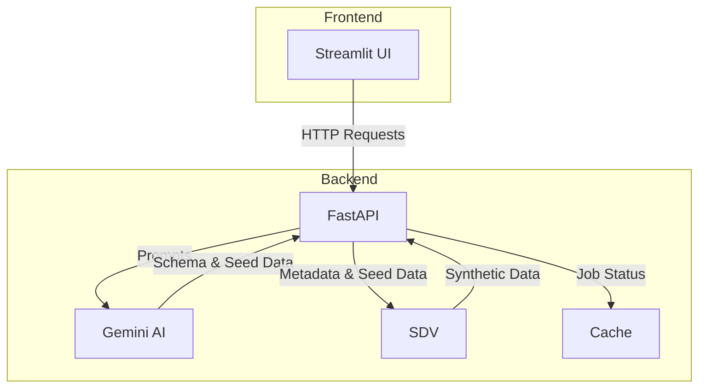

# Project Context: Matrix AI - Synthetic Data Generator

This document provides a high-level overview of the Matrix AI project, including its architecture, data schemas, file structure, and API endpoints.

## High-Level Architecture

The application follows a client-server architecture:

*   **Backend:** A FastAPI application that exposes a RESTful API for managing the synthetic data generation process. It handles the logic for interacting with the Gemini AI model, generating the data with SDV, and managing the job status.
*   **Frontend:** A Streamlit web application that provides a user-friendly interface for interacting with the backend. It guides the user through the four-step process of designing, synthesizing, reviewing, and downloading the data.

### Visual Architecture Diagram



## Data Flow

1.  **Design Request:** The user provides a natural language description of the desired data in the Streamlit UI. The frontend sends a `POST` request to the `/api/v1/design` endpoint.
2.  **AI-Powered Design:** The FastAPI backend receives the request and calls the `call_ai_agent` function in `ai.py`. This function sends a detailed prompt to the Gemini Pro model to generate a relational schema and seed data.
3.  **Review and Synthesize:** The generated schema and seed data are returned to the frontend for the user to review. If the user is satisfied, they provide their email and click "Synthesize Data," which sends a `POST` request to the `/api/v1/synthesize` endpoint.
4.  **Asynchronous Synthesis:** The backend starts a background task to generate the synthetic data using the `generate_sdv_data_optimized` function in `sdv.py`. This function uses the SDV library to generate the full dataset based on the provided schema and seed data. The job status is updated in the in-memory cache.
5.  **Monitoring and Notification:** The frontend periodically polls the `/api/v1/progress` endpoint to display the progress of the synthesis. Once the process is complete, the user receives an email notification.
6.  **Review and Download:** The user can then review samples of the generated data and download the complete dataset as a ZIP file from the `/api/v1/download` endpoint.

## Development Environment Setup

1.  **Prerequisites:**
    *   Python 3.8+
    *   `pip` and `virtualenv`

2.  **Create a virtual environment:**
    ```bash
    python3 -m venv venv
    source venv/bin/activate
    ```

3.  **Install dependencies:**
    ```bash
    pip install -r requirements.txt
    ```

4.  **Google Cloud Authentication:**
    *   Ensure you have a Google Cloud project with the Vertex AI API enabled.
    *   Authenticate your environment:
        ```bash
        gcloud auth application-default login
        ```

5.  **Run the application:**
    ```bash
    ./run.sh
    ```

## File Structure

```
/home/pavan_thalla/dev/V1--Matrix-AI/
├───.dockerignore
├───.gitignore
├───Dockerfile
├───requirements.txt
├───run.sh
├───backend/
│   ├───main.py             # FastAPI application entry point
│   └───core/
│       ├───ai.py           # Logic for interacting with the Gemini AI model
│       ├───analytics.py    # Data analysis and reporting functions
│       ├───cache.py        # In-memory cache for storing job status
│       ├───config.py       # Configuration settings
│       ├───google_auth.py  # Google Cloud authentication helper
│       ├───notifications.py# Email notification logic
│       ├───schemas.py      # Pydantic schemas for API requests and responses
│       └───sdv.py          # Synthetic Data Vault (SDV) generation logic
├───frontend/
│   ├───api.py              # Functions for making API calls to the backend
│   ├───app.py              # Main Streamlit application file
│   ├───styles.py           # CSS styles for the Streamlit app
│   └───components/
│       ├───sidebar.py      # Renders the sidebar in the Streamlit app
│       └───steps.py        # Renders the different steps in the UI
└───frontend_v1/            # (Older version of the frontend)
    ├───api.py
    ├───app.py
    ├───styles.py
    └───components/
        ├───sidebar.py
        ├───stepper.py
        └───steps.py
```

## Key Data Schemas

These are the Pydantic models used for API request and response validation.

*   **`DesignRequest`**
    *   `data_description: str`: Natural language description of the desired dataset.
    *   `num_records: int`: The number of records to generate.
    *   `existing_metadata: Optional[Dict[str, Any]]`: Optional existing metadata to refine.

*   **`SynthesizeRequest`**
    *   `num_records: int`: The number of records to generate.
    *   `metadata_dict: Dict[str, Any]`: The metadata schema for the data.
    *   `seed_tables_dict: Dict[str, Any]`: The seed data for the tables.
    *   `user_email: EmailStr`: The user's email address for notifications.
    *   `batch_size: Optional[int]`: The batch size for data generation.
    *   `use_fast_synthesizer: Optional[bool]`: Flag to use a faster synthesizer.

*   **`StoreRequest`**
    *   `confirm_storage: bool`: A boolean to confirm that the data has been stored/downloaded.

## API Endpoints

The following are the main API endpoints provided by the FastAPI backend.

*   **`POST /api/v1/design`**
    *   **Description:** Takes a data description and number of records, and returns an AI-generated schema and seed data.
    *   **Request Body:** `DesignRequest`
    *   **Response:** A JSON object with the generated metadata and seed data previews.

*   **`POST /api/v1/synthesize`**
    *   **Description:** Starts the data synthesis process in the background.
    *   **Request Body:** `SynthesizeRequest`
    *   **Response:** A confirmation message indicating that the process has started.

*   **`GET /api/v1/sample`**
    *   **Description:** Returns a sample of the synthesized data for a specific table or all tables.
    *   **Query Parameters:** `table_name: str` (optional), `sample_size: int` (optional)
    *   **Response:** A JSON object containing the data samples.

*   **`GET /api/v1/reports`**
    *   **Description:** Returns the analysis and metrics of the synthesized data.
    *   **Response:** A JSON object with synthesis metrics and distribution analysis.

*   **`POST /api/v1/store`**
    *   **Description:** Clears the cache after the user has downloaded the data.
    *   **Request Body:** `StoreRequest`
    *   **Response:** A confirmation message.

*   **`GET /api/v1/progress`**
    *   **Description:** Returns the current progress of the synthesis task.
    *   **Response:** A JSON object with the progress status.

*   **`GET /api/v1/download`**
    *   **Description:** Packages and returns all generated data and reports in a single ZIP file.
    *   **Response:** A ZIP file download.

## Core Components (`backend/core`)

*   **`ai.py`:** Handles all interactions with the Google Gemini Pro model. It uses a detailed prompt that instructs the model to act as a data architect, providing specific requirements for the JSON structure, data quality, and realism. The prompt also includes few-shot examples to guide the model's output.
*   **`sdv.py`:** Contains the logic for generating synthetic data using the SDV library. It uses `HMASynthesizer` for multi-table data and `GaussianCopulaSynthesizer` for single-table data. The module also includes robust data cleaning and validation functions to handle potential inconsistencies in the AI-generated seed data, such as fixing primary key uniqueness and referential integrity.
*   **`cache.py`:** A simple in-memory cache to store the state of the data generation process, including the design output, synthetic data, and progress status.
*   **`schemas.py`:** Defines the Pydantic models for API request and response validation.
*   **`analytics.py`:** Provides functions for analyzing the generated data and creating reports on data distribution and synthesis metrics.
*   **`notifications.py`:** Handles sending email notifications to the user upon completion or failure of the synthesis process.
*   **`config.py`:** Stores configuration variables, such as GCP project ID and GCS bucket name.
*   **`google_auth.py`:** Manages Google Cloud authentication.

## Deployment

The application is designed to be deployed using Docker. The `Dockerfile` in the root directory can be used to build a Docker image of the application. This image can then be deployed to any container orchestration platform, such as Google Cloud Run or Kubernetes.